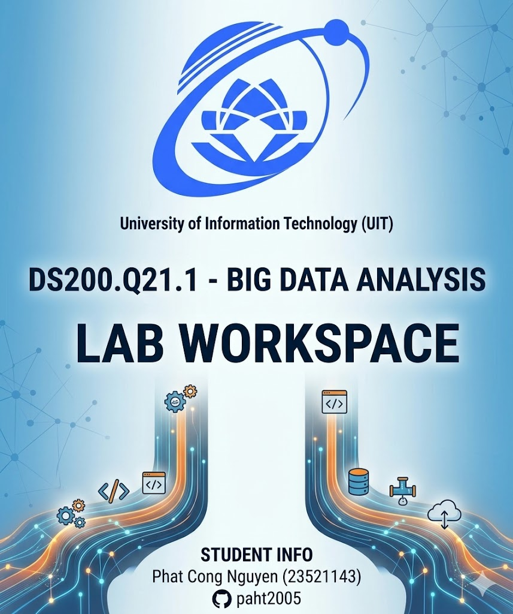

<p align="center">
  <a href="https://www.uit.edu.vn/" title="University of Information Technology">
    
  </a>
</p>

<h1 align="center"><b>DS200.Q21.1 - Big Data Analysis - Lab workspace</b></h1>

<p align="center">
  
  
  
  
  
</p>

<!-- Contact section: centered, single row of badges, short intro -->
<div align="center">

<!-- HEADER BANNER -->


<br/>

[](https://nguyen-cong-phat-portfolio.vercel.app/)
[](https://www.linkedin.com/in/ncp2005/)
[](mailto:congphatnguyen.work@gmail.com)
[](https://www.facebook.com/phat.nguyencong.2005/)

<br/>

> *"Everything is a win when the goal is experience."*


</div>


<p align="center">
  
</p>


---

## Student information

| Student ID | Full name        | GitHub                                  | Email                  |
|:----------:|------------------|-----------------------------------------|------------------------|
| 23521143   | Phat Cong Nguyen | [paht2005](https://github.com/paht2005) | 23521143@gm.uit.edu.vn |

---

## Purpose

This repository is the **course workspace** for **DS200.Q21.1**. Each lab is a **self-contained subdirectory** (data, Java processing stack, outputs, and lab-specific scripts) so you can add **Lab02**, **Lab03**, and so on later.

---

## Directory layout

```text
DS200.Q21.1_Lab/
├── README.md                    ← Workspace overview (this file)
├── slides/                      ← Course PDFs (e.g. Hadoop MapReduce tutorial)
│
├── DS200.Q21.1_Lab01/           ← Lab 01 — Movie ratings (Java MR + optional Streaming / pandas)
│   ├── README.md                ← Lab 01: outline, flows, run commands (start here)
│   ├── data/                    ← CSV-style .txt datasets
│   ├── hadoop/
│   │   ├── java/lab01-mapreduce/ ← Maven Java MapReduce (primary)
│   │   ├── streaming/           ← Optional Python mappers & reducers for Streaming
│   │   └── run_hadoop_cluster_example.sh
│   ├── scripts/
│   │   ├── run_java_mapreduce_local.sh     ← Build JAR + run Java drivers (needs hadoop + mvn)
│   │   ├── run_hadoop_streaming_local.sh   ← Optional: local Streaming (sort + pipes)
│   │   └── run_all_assignments.py          ← Optional pandas reference
│   ├── src/lab01/               ← Optional pandas implementation
│   ├── notebooks/               ← assignments.ipynb
│   ├── output/                  ← Task reports (.txt)
│   └── screenshots/             ← Submission images
│
├── DS200.Q21.1_Lab02/           ← Lab 02 — Hotel review text analytics (Apache Pig)
│   ├── README.md                ← Lab 02: tasks, run commands, results
│   ├── assignments.ipynb        ← Lab wording (Vietnamese)
│   ├── data/                    ← hotel-review.csv + stopwords.txt
│   ├── pig/                     ← Apache Pig Latin scripts (task01–task05)
│   ├── scripts/
│   │   ├── run_pig_local.sh     ← Run all Pig scripts locally (needs pig on PATH)
│   │   └── screenshots.sh       ← Display results for taking screenshots
│   ├── output/pig_*/part-r-00000 ← Pig result files
│   └── screenshots/             ← Terminal screenshots with student info
│
└── DS200.Q21.1_Lab03/           ← Lab 03 — Movie analytics with Java Spark RDD
  ├── README.md                ← Lab 03: tasks, run commands, outputs
  ├── assignments.ipynb        ← Lab wording (Vietnamese)
  ├── data/                    ← movies.txt, ratings_1.txt, ratings_2.txt, users.txt, occupation.txt
  ├── scripts/
  │   ├── run_java_rdd_local.sh ← Build + run all 6 Java RDD tasks locally
  │   └── java.sh              ← Convenience wrapper for the main script
  ├── spark/java/lab03-rdd/    ← Maven Java Spark project (RDD implementation)
  ├── output/                  ← Task reports (.txt)
  └── screenshots/             ← Submission screenshots
```

Add future labs as siblings (e.g. `DS200.Q21.1_Lab03/`), each with its own `README.md`.

---

## Workflow

1. **IDE:** open **`DS200.Q21.1_Lab`** to see all labs, or open a single lab folder.
2. **Terminal:** `cd` into the lab folder before running scripts, for example:

   ```bash
   cd /path/to/DS200.Q21.1_Lab/DS200.Q21.1_Lab01   # Lab 01
   cd /path/to/DS200.Q21.1_Lab/DS200.Q21.1_Lab02   # Lab 02
   cd /path/to/DS200.Q21.1_Lab/DS200.Q21.1_Lab03   # Lab 03
   ```

3. **Docs:** each lab has its own `README.md` with setup, run commands, and submission steps.

---

## Git and GitHub

- **One repo for the whole course:** `git init` in **`DS200.Q21.1_Lab`** and commit `DS200.Q21.1_Lab01`, …
- **One repo per lab:** `git init` inside each `DS200.Q21.1_Lab0X` if the syllabus requires it.

---

## Example paths

```
Downloads/DS200.Q21.1_Lab/DS200.Q21.1_Lab01/   # Lab 01 — MapReduce
Downloads/DS200.Q21.1_Lab/DS200.Q21.1_Lab02/   # Lab 02 — Apache Pig
Downloads/DS200.Q21.1_Lab/DS200.Q21.1_Lab03/   # Lab 03 — Java Spark RDD
```

Keep the parent folder **`DS200.Q21.1_Lab`** as the root that contains each **`DS200.Q21.1_Lab0X`** lab directory.
